

# 🏙️ Mi Voz Urbana

### Tarea Integradora: Prototipo de Aplicación Móvil en un Contexto Empresarial

---

## 📋 Información del Equipo

**Nombre del Equipo:** alcorn

**Nombre del Producto:** Mi Voz Urbana

### 👥 Integrantes del Equipo

| Matrícula | Nombre Completo | GitHub |
|-----------|----------------|---------|
| 220512 | Orlando Méndez Montes | [@MendezPro](https://github.com/MendezPro) |
| 220385 | Alina Bonilla Paredes | [@CarlosJ67-](https://github.com/CarlosJ67-) |
| 220100 | Neftalí Arturo Hernández Vergara | [@Nefta11](https://github.com/Nefta11) |
| 220472 | Carlos Jesús Carballo Cruz | [@CarlosJ67](https://github.com/CarlosJ67) |

---

## 🎨 Identidad de Imagen

### Logotipos

<table>
<tr>
<td align="center" width="50%">
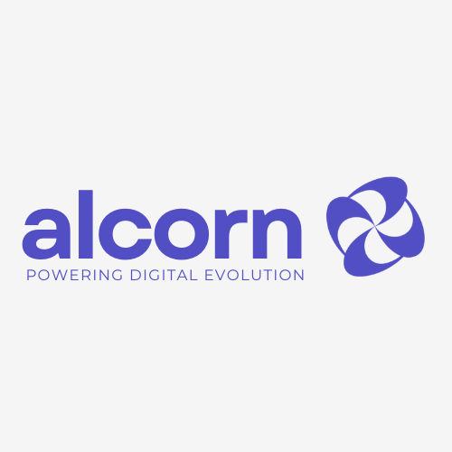
 
<b>Logotipo de la Empresa</b>
</td>
<td align="center" width="50%">

 
<b>Logotipo del Producto</b>
</td>
</tr>
</table>

### Paleta de Colores
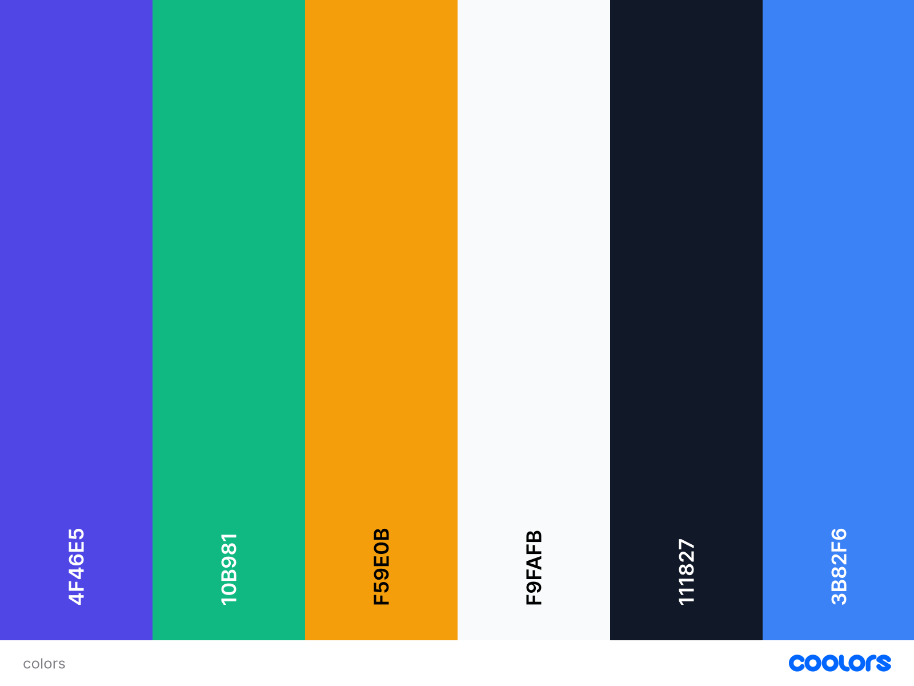

### Tipografías

**Tipografía Principal:** Inter / System Default
- Títulos: Inter Bold (700)
- Subtítulos: Inter SemiBold (600)
- Cuerpo: Inter Regular (400)
- Captions: Inter Medium (500)

**Tipografía Secundaria:** SF Pro Display / Roboto
- Para elementos del sistema y navegación

---

## 📱 Descripción General del Prototipo

**VozUrbana** es una plataforma móvil innovadora diseñada para empoderar a los ciudadanos en la mejora de su entorno urbano. La aplicación permite a los usuarios reportar problemáticas urbanas como baches, iluminación deficiente, acumulación de basura, vandalismo y otras incidencias que afectan la calidad de vida en sus comunidades.

A través de una interfaz intuitiva y moderna, los ciudadanos pueden documentar problemas mediante fotografías, ubicación GPS precisa y descripciones detalladas. La plataforma categoriza automáticamente los reportes por tipo y prioridad, facilitando su gestión y seguimiento. Los usuarios pueden visualizar en un mapa interactivo todos los reportes de su zona, seguir el estado de sus denuncias y participar activamente en la construcción de ciudades más seguras y habitables.

VozUrbana promueve la transparencia gubernamental y la participación ciudadana, creando un canal directo de comunicación entre la población y las autoridades responsables. La aplicación incluye sistema de autenticación segura, perfiles de usuario personalizables, estadísticas de impacto comunitario y notificaciones en tiempo real sobre el progreso de los reportes. Con VozUrbana, cada ciudadano tiene voz para transformar su ciudad.

---

## 🎯 Objetivo General

Desarrollar una aplicación móvil multiplataforma que facilite la participación ciudadana en el reporte y seguimiento de problemáticas urbanas, promoviendo la transparencia gubernamental y mejorando la calidad de vida en las comunidades mediante la gestión eficiente de incidencias urbanas con tecnologías web progresivas.

---

## 🎯 Objetivos Específicos

1. **Implementar un sistema de reporte geolocalizado** que permita a los usuarios documentar problemáticas urbanas con fotografías, ubicación GPS precisa y descripciones detalladas en menos de 3 minutos.

2. **Desarrollar un mapa interactivo** que visualice en tiempo real todos los reportes de la comunidad, permitiendo filtros por categoría, prioridad y estado de resolución.

3. **Crear un sistema de autenticación seguro** utilizando OAuth 2.0 con Google, garantizando la identidad de los usuarios y la integridad de los reportes.

4. **Diseñar un sistema de categorización inteligente** que clasifique automáticamente los reportes en al menos 8 categorías diferentes (infraestructura, servicios, seguridad, medio ambiente, etc.).

5. **Establecer un sistema de seguimiento de estado** que notifique a los usuarios sobre el progreso de sus reportes (Pendiente, En Revisión, En Proceso, Resuelto, Rechazado).

6. **Implementar un perfil de usuario con estadísticas** que muestre el impacto individual y comunitario, incluyendo reportes realizados, problemas resueltos y contribución ciudadana.

7. **Desarrollar una API RESTful robusta** que gestione todos los datos de la aplicación, garantizando escalabilidad, seguridad y tiempos de respuesta menores a 2 segundos.

8. **Optimizar la aplicación para funcionar offline** mediante service workers y caché local, permitiendo crear borradores de reportes sin conexión a internet.

---

## 🏢 Organigrama

 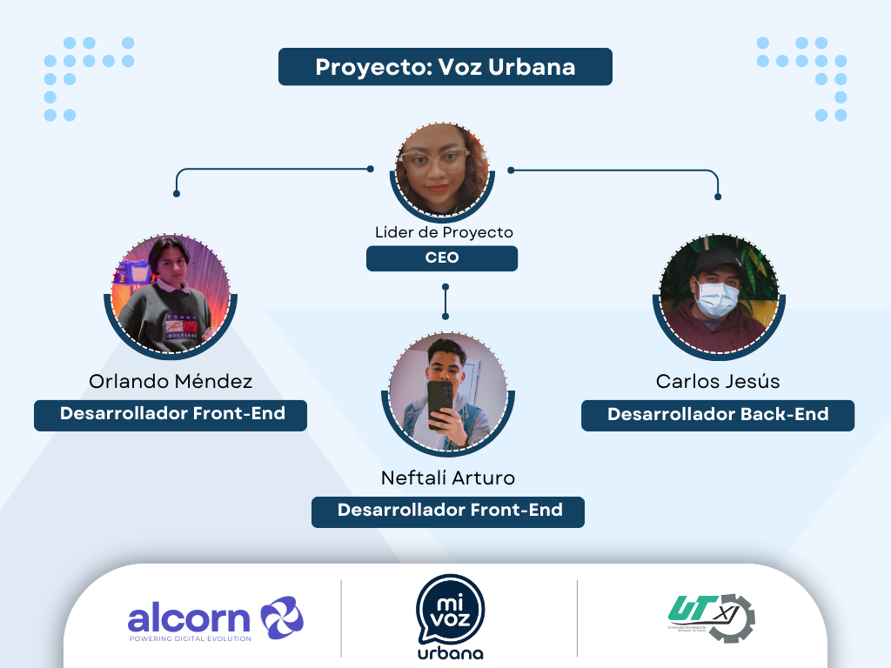

---

## 👔 Tabla de Roles

| Rol | Responsable | Responsabilidades |
|-----|------------|-------------------|
| **Scrum Master** | Alina Bonilla Paredes | - Facilitar ceremonias Scrum - Eliminar impedimentos - Proteger al equipo - Promover mejora continua efinir visión del producto - Gestionar backlog de producto - Priorizar funcionalidades - Validar entregas|
| **Frontend Developer** | Neftalí Arturo Hernández Vergara | - Desarrollo de componentes React Native - Implementación de UI/UX - Integración con API - Optimización de rendimiento |
| **Backend Developer / API** | Carlos Jesús Carballo Cruz | - Diseño y desarrollo de API REST - Gestión de base de datos - Implementación de autenticación - Documentación técnica |
| **UI/UX Designer** | Orlando Méndez Montes | - Diseño de interfaz de usuario - Creación de wireframes y mockups - Definición de flujos de navegación - Prototipado interactivo |

---

## 📅 Diagrama de Gantt (Cronograma de Actividades)

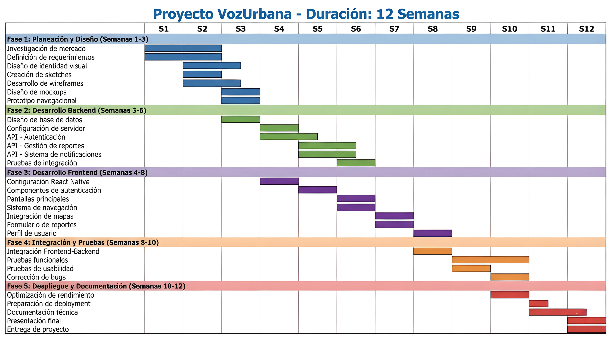

---

## ⚙️ Requerimientos Funcionales

### RF-01: Autenticación de Usuarios
El sistema debe permitir a los usuarios registrarse e iniciar sesión utilizando su cuenta de Google mediante OAuth 2.0, garantizando la seguridad de la información personal.

### RF-02: Creación de Reportes
Los usuarios deben poder crear reportes de problemáticas urbanas incluyendo título, descripción, categoría, prioridad, ubicación GPS y hasta 3 fotografías.

### RF-03: Visualización en Mapa Interactivo
El sistema debe mostrar todos los reportes georreferenciados en un mapa interactivo con marcadores diferenciados por categoría y estado.

### RF-04: Categorización de Reportes
La aplicación debe clasificar los reportes en al menos 8 categorías: Baches, Iluminación, Basura, Vandalismo, Agua Potable, Alcantarillado, Áreas Verdes y Otros.

### RF-05: Sistema de Prioridades
Los usuarios deben poder asignar un nivel de prioridad a cada reporte (Baja, Media, Alta, Crítica) según la gravedad del problema.

### RF-06: Seguimiento de Estado
El sistema debe actualizar y mostrar el estado de cada reporte (Pendiente, En Revisión, En Proceso, Resuelto, Rechazado) con timestamps de cada cambio.

### RF-07: Perfil de Usuario
Los usuarios deben tener un perfil personalizable que muestre sus estadísticas: reportes realizados, resueltos, en proceso y puntos de contribución.

### RF-08: Búsqueda y Filtrado
La aplicación debe permitir buscar y filtrar reportes por categoría, prioridad, estado, fecha y proximidad geográfica.

### RF-09: Notificaciones Push
El sistema debe enviar notificaciones push a los usuarios cuando el estado de sus reportes cambie o cuando se resuelva un problema reportado.

### RF-10: Visualización de Detalle de Reporte
Los usuarios deben poder ver información completa de cada reporte incluyendo: fotos, descripción, ubicación exacta, fecha de creación, historial de estados y comentarios.

### RF-11: Modo Offline
La aplicación debe permitir crear borradores de reportes sin conexión a internet y sincronizarlos automáticamente cuando se restablezca la conectividad.

### RF-12: Sistema de Validación
El sistema debe validar que todos los campos obligatorios estén completos antes de permitir la publicación de un reporte.

### RF-13: Galería de Imágenes
Los usuarios deben poder capturar fotos directamente desde la cámara o seleccionarlas desde la galería del dispositivo.

### RF-14: Geolocalización Automática
La aplicación debe detectar automáticamente la ubicación actual del usuario para facilitar el reporte de problemas cercanos.

---

## 🔧 Requerimientos No Funcionales

### RNF-01: Rendimiento
La aplicación debe cargar la pantalla principal en menos de 2 segundos y responder a las interacciones del usuario en menos de 500ms.

### RNF-02: Usabilidad
La interfaz debe ser intuitiva y seguir las guías de diseño Material Design para Android e iOS Human Interface Guidelines para iOS, permitiendo a usuarios sin experiencia técnica crear un reporte en menos de 3 minutos.

### RNF-03: Compatibilidad
La aplicación debe funcionar correctamente en dispositivos Android 8.0+ e iOS 13.0+, adaptándose a diferentes tamaños de pantalla (smartphones y tablets).

### RNF-04: Seguridad
El sistema debe implementar encriptación SSL/TLS para todas las comunicaciones, almacenamiento seguro de tokens de autenticación y protección contra inyección SQL y XSS.

### RNF-05: Escalabilidad
La arquitectura backend debe soportar al menos 10,000 usuarios concurrentes y 50,000 reportes almacenados sin degradación significativa del rendimiento.

### RNF-06: Disponibilidad
El sistema debe mantener una disponibilidad del 99.5%, con mecanismos de respaldo y recuperación ante fallos en menos de 30 minutos.

### RNF-07: Mantenibilidad
El código debe seguir estándares de desarrollo (ESLint, Prettier), estar documentado con JSDoc y utilizar arquitectura modular para facilitar actualizaciones futuras.

### RNF-08: Accesibilidad
La aplicación debe cumplir con WCAG 2.1 nivel AA, incluyendo soporte para lectores de pantalla, contraste adecuado de colores y tamaños de fuente ajustables.

---

## 📖 Historias de Usuario

### HU-01: Registro de Usuario
**Como** ciudadano preocupado por mi comunidad  
**Quiero** registrarme en la aplicación con mi cuenta de Google  
**Para** poder reportar problemas urbanos de forma segura y verificada

**Criterios de Aceptación:**
- El usuario puede hacer clic en "Iniciar con Google"
- Se redirige al flujo de autenticación de Google OAuth 2.0
- Tras autenticarse exitosamente, se crea un perfil de usuario automáticamente
- El usuario es redirigido a la pantalla principal de la aplicación

---

### HU-02: Crear Reporte de Bache
**Como** conductor  
**Quiero** reportar un bache en mi calle con foto y ubicación  
**Para** que las autoridades lo reparen y evitar accidentes

**Criterios de Aceptación:**
- El usuario puede acceder al formulario de reporte desde la pantalla principal
- Puede tomar o seleccionar hasta 3 fotos del bache
- La ubicación GPS se captura automáticamente
- Puede seleccionar la categoría "Baches" y prioridad "Alta"
- El reporte se guarda y aparece en el mapa

---

### HU-03: Visualizar Reportes en Mapa
**Como** residente local  
**Quiero** ver todos los problemas reportados en mi zona en un mapa  
**Para** conocer las problemáticas de mi comunidad y evitar áreas problemáticas

**Criterios de Aceptación:**
- El mapa muestra todos los reportes con marcadores de colores según categoría
- Al hacer clic en un marcador, se muestra información resumida del reporte
- El usuario puede hacer zoom y desplazarse por el mapa
- Los reportes se agrupan cuando hay múltiples en la misma área

---

### HU-04: Seguimiento de Estado de Reporte
**Como** usuario que reportó un problema  
**Quiero** recibir notificaciones cuando cambie el estado de mi reporte  
**Para** saber si mi denuncia está siendo atendida

**Criterios de Aceptación:**
- El usuario recibe una notificación push cuando el estado cambia
- Puede ver el historial completo de cambios de estado con fechas
- Los estados posibles son: Pendiente, En Revisión, En Proceso, Resuelto, Rechazado
- Puede acceder a sus reportes desde su perfil

---

### HU-05: Ver Perfil y Estadísticas
**Como** usuario activo de la plataforma  
**Quiero** ver mis estadísticas de contribución  
**Para** conocer mi impacto en la mejora de mi ciudad

**Criterios de Aceptación:**
- El perfil muestra: nombre, foto, email
- Muestra estadísticas: total de reportes, resueltos, en proceso, pendientes
- Calcula puntos de contribución según actividad
- Permite editar información personal

---

### HU-06: Filtrar Reportes por Categoría
**Como** usuario de la aplicación  
**Quiero** filtrar los reportes en el mapa por categoría  
**Para** enfocarme en tipos específicos de problemas

**Criterios de Aceptación:**
- Hay un menú de filtros accesible desde el mapa
- Se pueden seleccionar múltiples categorías simultáneamente
- El mapa se actualiza en tiempo real al aplicar filtros
- Se muestra el número de reportes por cada categoría

---

### HU-07: Reportar Problema de Iluminación
**Como** peatón que transita de noche  
**Quiero** reportar farolas fundidas o dañadas  
**Para** mejorar la seguridad en mi colonia

**Criterios de Aceptación:**
- Puede seleccionar la categoría "Iluminación"
- Puede especificar el tipo: farola fundida, cableado expuesto, oscuridad total
- Puede indicar si es zona escolar o de alto tráfico
- El reporte incluye hora de detección del problema

---

### HU-08: Modo Offline
**Como** usuario en zona sin cobertura  
**Quiero** crear un borrador de reporte sin internet  
**Para** publicarlo después cuando tenga conexión

**Criterios de Aceptación:**
- La app detecta cuando no hay conexión y muestra un indicador
- Permite llenar el formulario completo incluyendo fotos
- Guarda el borrador localmente en el dispositivo
- Sincroniza automáticamente cuando se restablece la conexión
- Muestra notificación cuando el reporte se ha publicado exitosamente

---

### HU-09: Ver Detalle Completo de Reporte
**Como** ciudadano interesado  
**Quiero** ver todos los detalles de un reporte específico  
**Para** entender mejor el problema y su solución

**Criterios de Aceptación:**
- Muestra todas las fotos en tamaño completo
- Presenta descripción completa, categoría y prioridad
- Muestra ubicación exacta con dirección legible
- Incluye fecha de creación y última actualización
- Muestra historial de cambios de estado
- Permite compartir el reporte en redes sociales

---

### HU-10: Buscar Reportes Cercanos
**Como** usuario móvil  
**Quiero** encontrar reportes cerca de mi ubicación actual  
**Para** reportar problemas que observo mientras me desplazo

**Criterios de Aceptación:**
- Hay un botón "Cerca de mí" en el mapa
- Centra el mapa en la ubicación actual del usuario
- Muestra reportes en un radio de 1km
- Lista los reportes más cercanos ordenados por distancia
- Muestra la distancia en metros/kilómetros

---

## ✏️ Sketches

### Sketch 1: Splash y Loading screen

### Sketch 2: Login y Registro
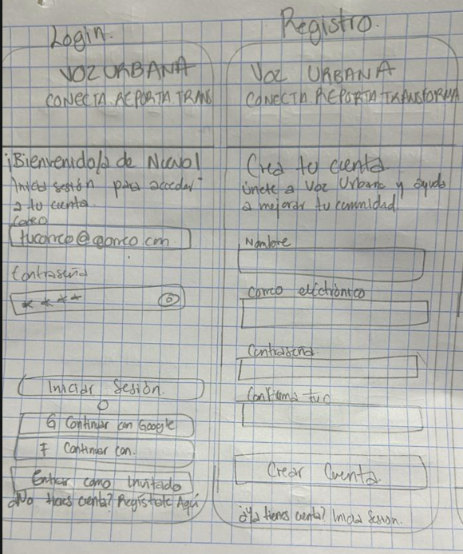

### Sketch 3: Pantalla Principal (Home)
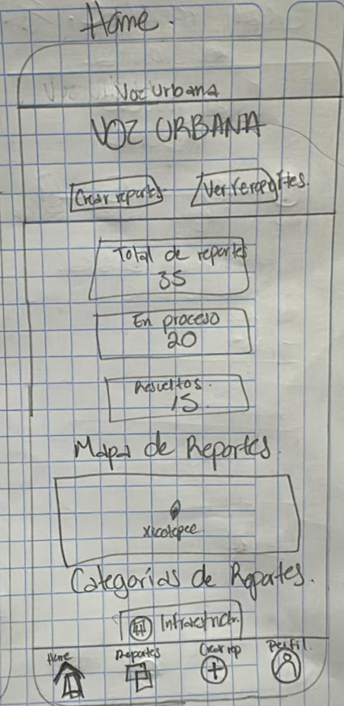

### Sketch 4: Formulario de Reporte
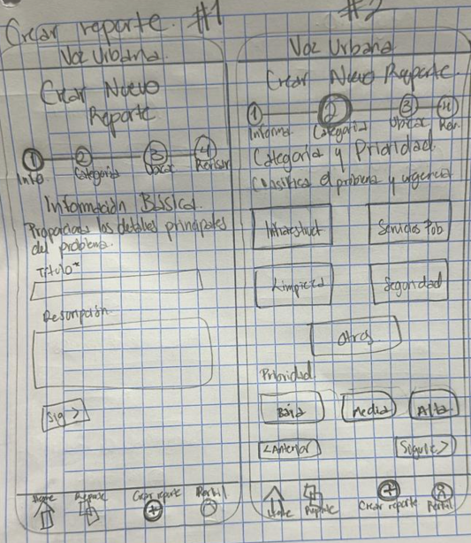

### Sketch 5: Perfil de Usuario y  Mapa Interactivo
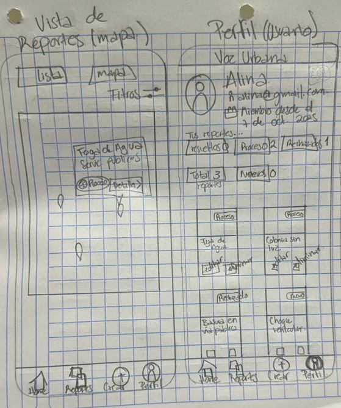

### Sketch 6: Dashboard
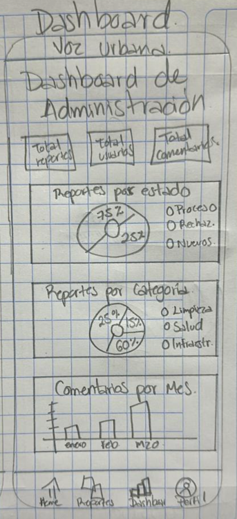

### Sketch 7: Configuración
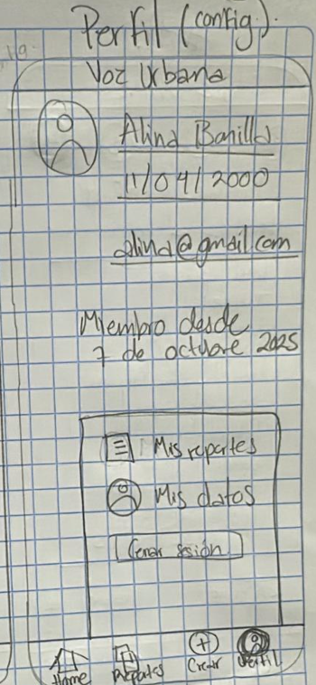

---

## 🎨 Wireframes

### Wireframe 1: Splash Screen (Pantalla de Inicio)
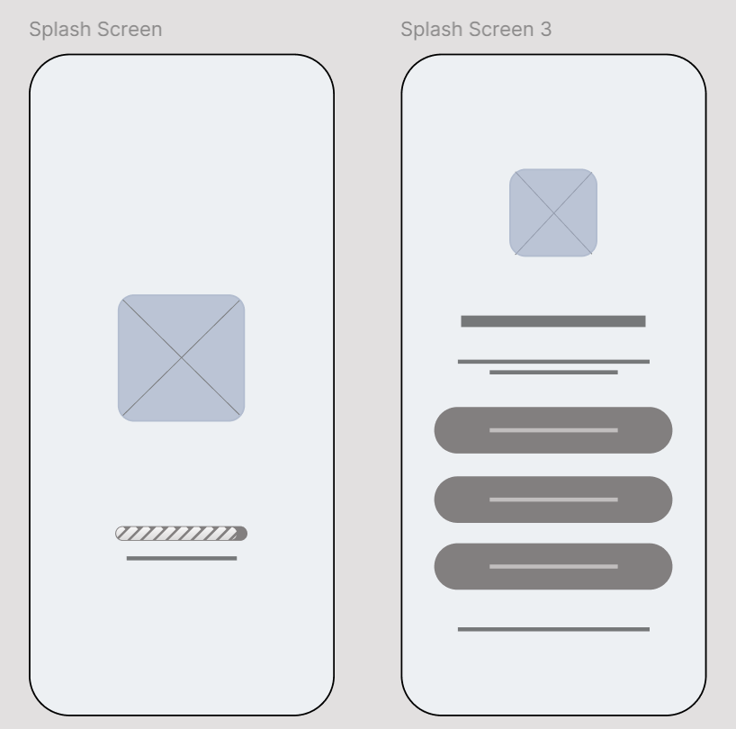

---

### Wireframe 2: Login y Registro

---

### Wireframe 3: Home Screen (Pantalla Principal)
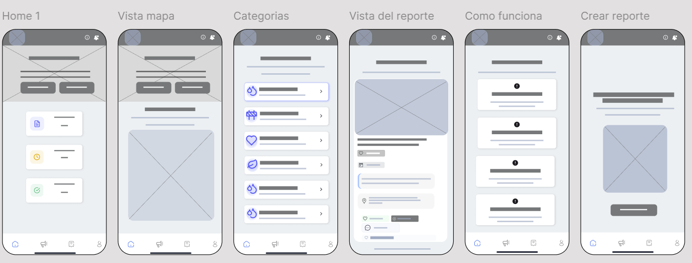
---

### Wireframe 4: Crear Reporte
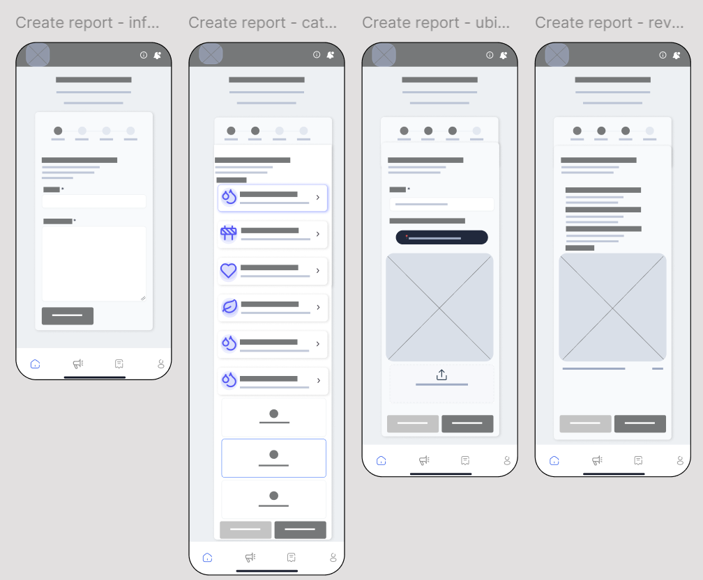

---

### Wireframe 5: Vista de Detalle de Reporte
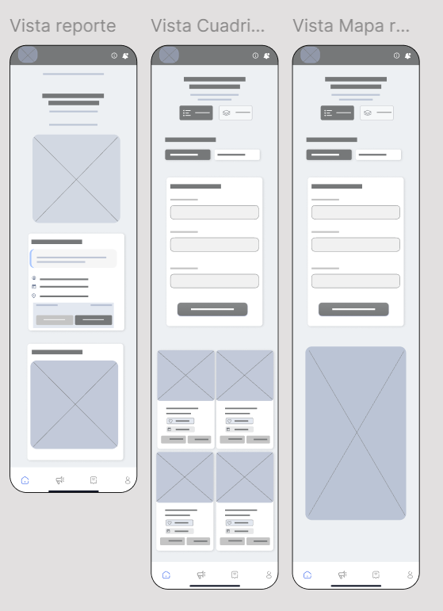

---

### Wireframe 6: Perfil de Usuario

---

### Wireframe 7: Acerca de Nosotros
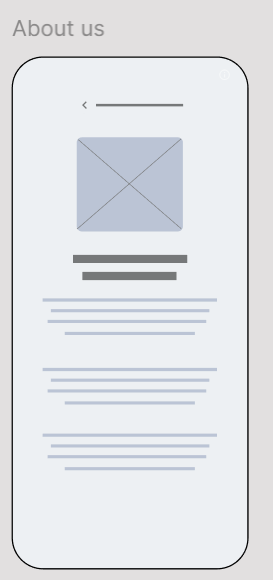

---

## 🎨 Mockups

> Los mockups muestran el diseño final de alta fidelidad con colores, tipografías, iconos y elementos visuales completos.

### Mockup 1: Splash Screen
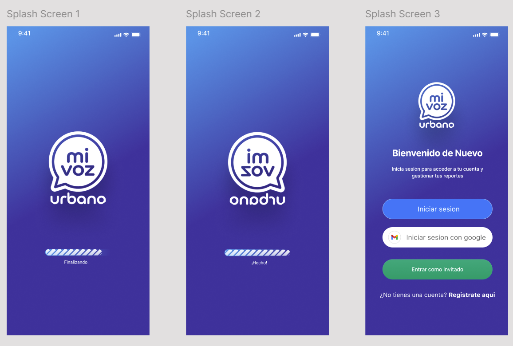

**Detalles de diseño:**
- Background con gradient principal (#4F46E5 a #10B981)
- Logo VozUrbana animado con efecto fade-in
- Loader circular con colores de marca
- Transición suave de 2 segundos
- Tipografía Inter Bold para branding

---

### Mockup 2: Login y Registro

**Detalles de diseño:**
- Background gradient sutil
- Inputs con bordes redondeados y estados hover/focus/error
- Paleta de colores aplicada (Primary, Secondary)
- Iconos de @expo/vector-icons
- Validación visual con colores (Success: verde, Error: rojo)
- Sombras sutiles en cards (shadow-md)

---

### Mockup 3: Home Screen (Pantalla Principal)
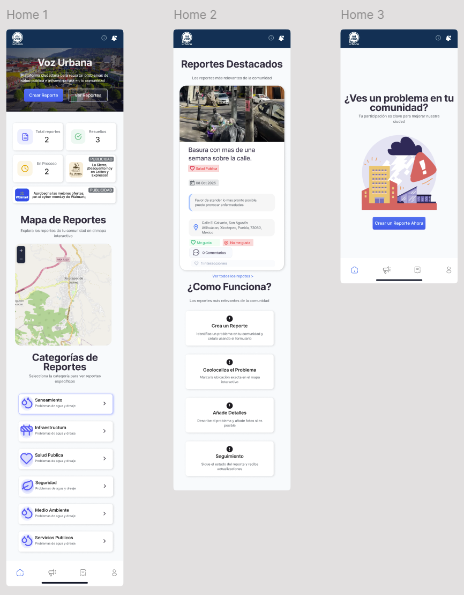

**Detalles de diseño:**
- Header con logo de marca
- Cards de reportes destacados con sombras y bordes redondeados
- Badges de prioridad con colores diferenciados:
  - Crítica: #EF4444 (Rojo)
  - Alta: #F59E0B (Ámbar)
  - Media: #3B82F6 (Azul)
  - Baja: #6B7280 (Gris)
- Grid de categorías con iconos personalizados y colores
- Mapa preview con estilo personalizado
- Bottom tabs con indicador activo y micro-interacciones
- Tipografía Inter para todo el contenido

---

### Mockup 4: Crear Reporte
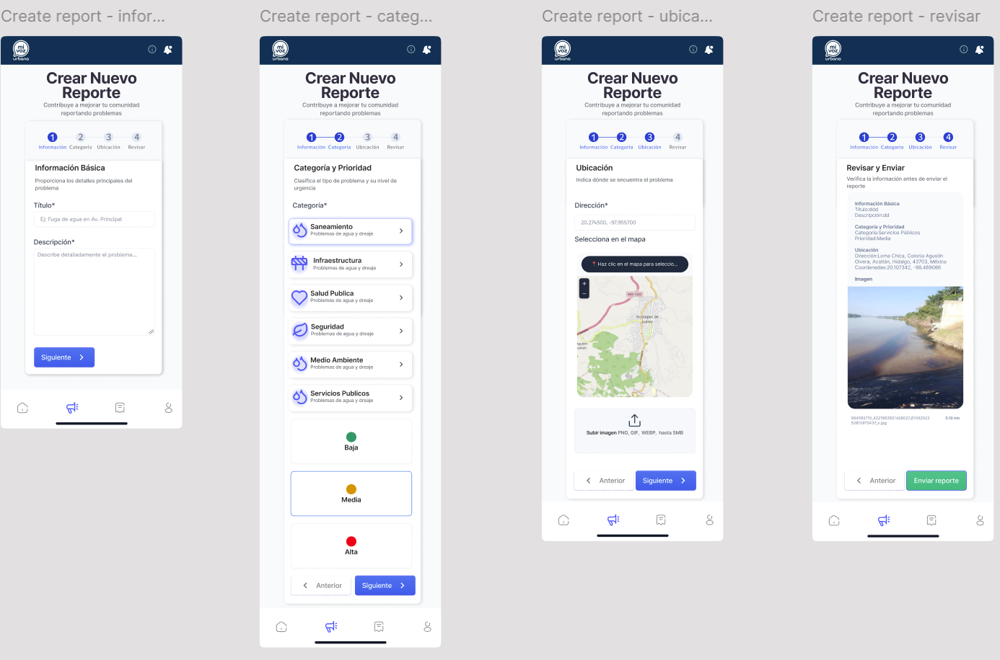

**Detalles de diseño:**
- Progress steps con animación y colores de estado
- Categorías con estados hover/active/disabled
- Selector de prioridad con radio buttons estilizados
- Campos de formulario con:
  - Labels flotantes
  - Validación visual en tiempo real
  - Contador de caracteres
  - Placeholders descriptivos
- Image picker con preview en grid
- Mapa interactivo para selección de ubicación
- Botones con estados disabled/enabled/loading
- Micro-interacciones al completar cada paso

---

### Mockup 5: Vista de Detalle de Reporte
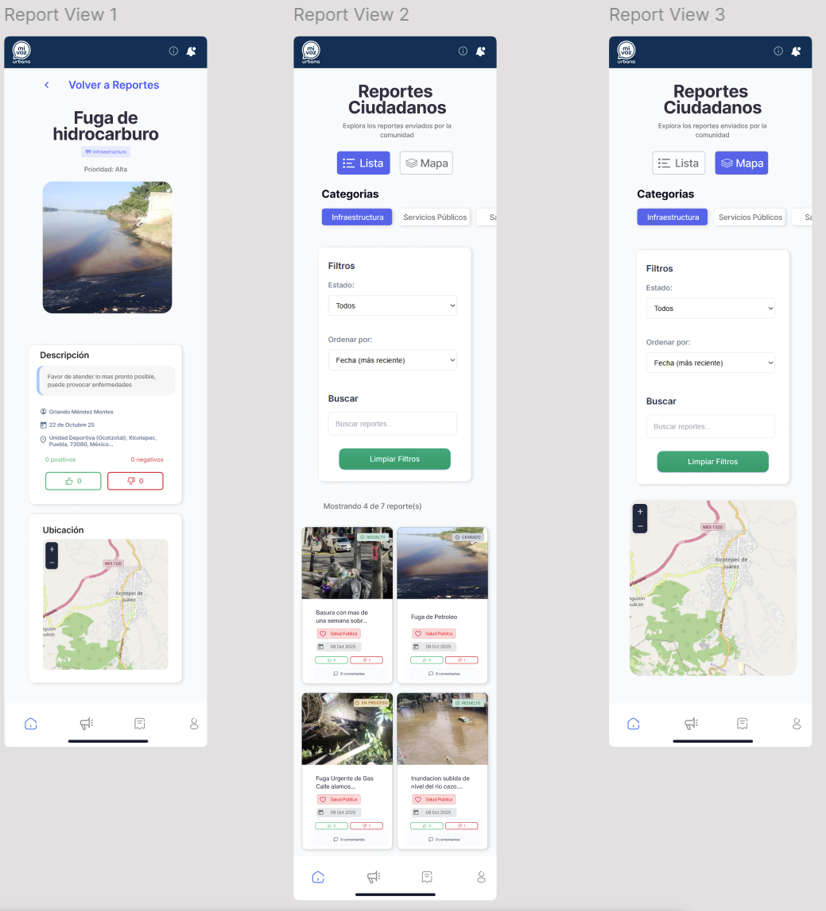

**Detalles de diseño:**
- Timeline vertical de estados con:
  - Iconos personalizados
  - Línea conectora con gradient
  - Timestamps formateados
- Secciones organizadas con dividers
- Map preview con marker personalizado
- Action buttons flotantes:
  - Compartir (con sheet de opciones)
  - Guardar (con animación de feedback)
  - Reportar problema
- Chip de categoría y badge de prioridad
- Información del usuario con avatar

---

### Mockup 6: Perfil de Usuario
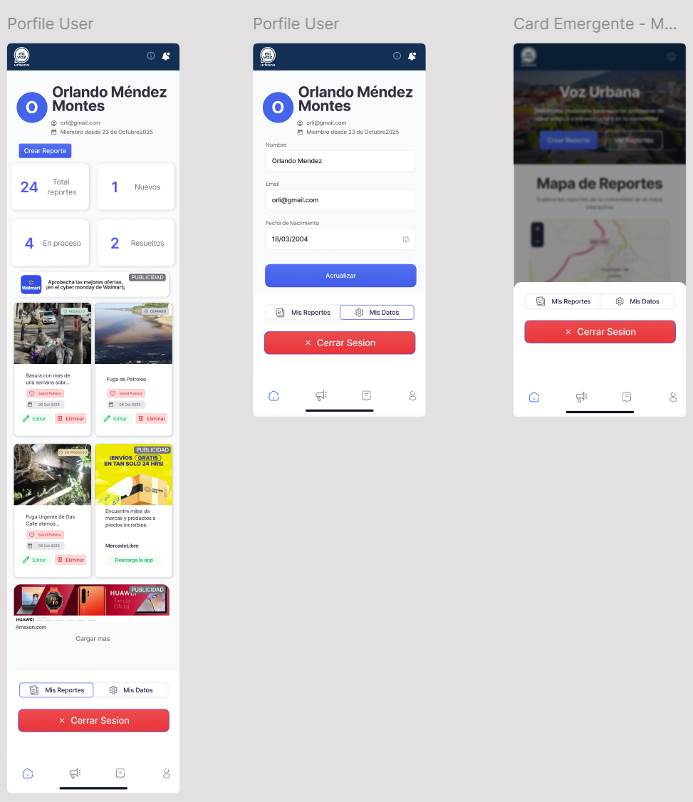

**Detalles de diseño:**
- Avatar con border gradient animado
- Header con background gradient
- Stats cards con:
  - Iconos y colores diferenciados
  - Números grandes destacados
  - Animación al cargar
- Gráfico circular de progreso con colores de marca
- Lista de reportes con:
  - Thumbnails redondeados
  - Estados con badges
  - Swipe actions (editar, eliminar)
- Tabs con indicador deslizante
- Botón de edición con ícono

---
## 🔗 Prototipo Navegacional

### Flujo de Navegación Principal
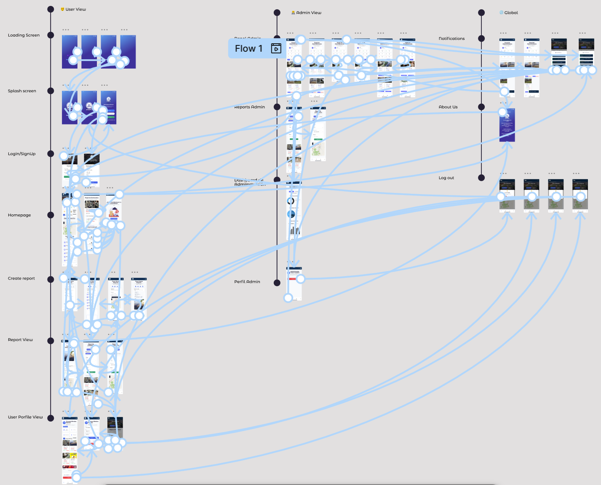

### Navegación Bottom Tab

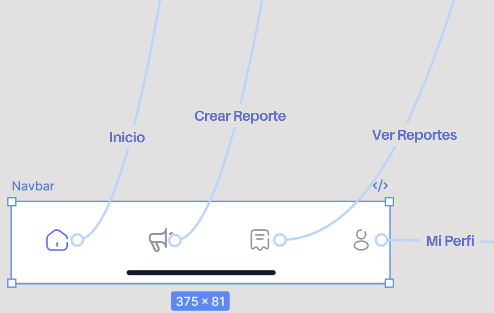

**Link al prototipo interactivo:** [Figma Prototype](https://www.figma.com/design/bK3SJoSLAPeSvsdQLArXOD/Mobile-App-Voz-Urbana?node-id=7-426&t=6s6HjavHg83qSSvs-1)

---

## 🌐 API (Backend)

### Repositorio de la API
**URL:** [VozUrbana-API](https://github.com/CarlosJ67/Backend-Voz-Urbana.git)

---

## 📱 Prototipo Programado (Avances)

### Estado Actual del Desarrollo: 85% Completado

#### ✅ Funcionalidades Implementadas

**1. Autenticación y Gestión de Usuario**
- [✅] Login con Google OAuth 2.0
- [✅] Registro de usuarios
- [✅] Pantalla de bienvenida (Landing)
- [✅] Contexto de autenticación (AuthContext)
- [✅ Persistencia de sesión con AsyncStorage

**2. Navegación**
- [✅] Stack Navigation principal
- [✅] Bottom Tab Navigator (5 tabs)
- [✅] Custom Header con logo y acciones
- [✅] Custom Bottom Tab Bar

**3. Pantallas Principales**
- [✅] HomeScreen - Pantalla principal con reportes destacados
- [✅] ReportsScreen - Lista completa de reportes
- [✅] MapView - Mapa interactivo con Leaflet
- [✅] ProfileScreen - Perfil de usuario con estadísticas
- [✅] ReportDetailScreen - Detalle completo de reportes

**4. Creación de Reportes**
- [✅] CreateReportScreen - Formulario multi-paso
- [✅] CategorySelector - Selector de categorías
- [✅] PrioritySelector - Selector de prioridad
- [✅] FormInput - Inputs personalizados
- [✅] ProgressSteps - Indicador de progreso
- [✅] ReviewSection - Revisión antes de enviar

**5. Componentes Reutilizables**
- [✅] ReportCard - Tarjeta de reporte
- [✅] FeaturedReportCard - Tarjeta destacada
- [✅] CustomAlert - Alertas personalizadas
- [✅] CustomConfirmAlert - Confirmaciones
- [✅] LoadingModal - Indicador de carga
- [✅] Toast - Notificaciones toast

**6. Contextos y Estado**
- [✅] AuthContext - Gestión de autenticación
- [✅] ReportContext - Gestión de reportes
- [✅] ToastContext - Notificaciones globales

**7. Servicios**
- [✅] ApiService - Cliente HTTP para API
- [✅] Integración con backend
- [✅] Manejo de errores
- [✅] Interceptores de peticiones

**8. Utilidades**
- [✅] Paleta de colores unificada
- [✅] Helpers de fechas
- [✅] Configuración de reportes

#### 🚧 En Desarrollo

**1. Mapa Interactivo** (80%)
- [✅] Visualización de mapa
- [✅] Marcadores de reportes
- [ ] Clustering de marcadores
- [ ] Geolocalización en tiempo real

**2. Sistema de Notificaciones** (40%)
- [✅ ] Push notifications
- [ ] Centro de notificaciones
- [ ] Badge counter

**3. Modo Offline** (30%)
- [ ] Service Workers
- [ ] Cache de datos
- [ ] Sincronización automática

#### 📋 Pendiente

**1. Búsqueda y Filtros Avanzados**
- [ ] Búsqueda por texto
- [ ] Filtros combinados
- [ ] Guardado de filtros favoritos

**2. Compartir en Redes Sociales**
- [ ] Botón compartir
- [ ] Deep linking
- [ ] Preview cards

**3. Sistema de Puntos y Gamificación**
- [ ] Badges de logros
- [ ] Ranking de usuarios
- [ ] Sistema de niveles

**4. Testing**
- [ ] Unit tests (Jest)
- [ ] Integration tests
- [ ] E2E tests (Detox)

---

## 📊 Presentación

### Link a Presentación
**Google Drive:** [VozUrbana - Presentación Final](https://drive.google.com/file/d/1JyCYMOzJQJOFjrdSfnNyGAZjqFP_UZpm/view?usp=sharing)

---

## 💡 Conclusiones

El desarrollo de VozUrbana confirmó que el éxito de un proyecto tecnológico no depende únicamente de la escritura de código, sino de la capacidad para integrar la ingeniería de software con una visión estratégica de negocio y metodologías ágiles. La implementación de una arquitectura escalable con React Native y Node.js, respaldada por un diseño centrado en el usuario, nos permitió experimentar de primera mano cómo se construye software de calidad en la industria. Aprendimos que la documentación rigurosa y la planificación previa no son trámites burocráticos, sino los pilares que garantizan la viabilidad y el mantenimiento del producto a largo plazo. A nivel profesional, la mayor lección fue comprender el valor de la sinergia multidisciplinaria. Enfrentar desafíos técnicos complejos, como la integración de geolocalización y el manejo de datos, nos obligó a ser flexibles y a combinar nuestras distintas especialidades para encontrar soluciones eficientes. Más allá de la competencia técnica adquirida, nos llevamos la convicción de que la tecnología cobra su verdadero sentido cuando se utiliza para el empoderamiento ciudadano. VozUrbana demuestra que, con organización y propósito, es posible crear herramientas digitales que realmente fomenten la participación y mejoren la calidad de vida en nuestras ciudades.

## 🙏 Agradecimientos

- A nuestro profesor de Desarrollo Movil Integral, por su guía y apoyo.

- A todos los ciudadanos que creen en el poder de la participación para transformar nuestras ciudades.

---

### 🏙️ VozUrbana - Tu Voz Puede Cambiar Tu Ciudad

**Desarrollado con ❤️ por el equipo alcorn**

[⬆ Volver arriba](#-vozurbana)

